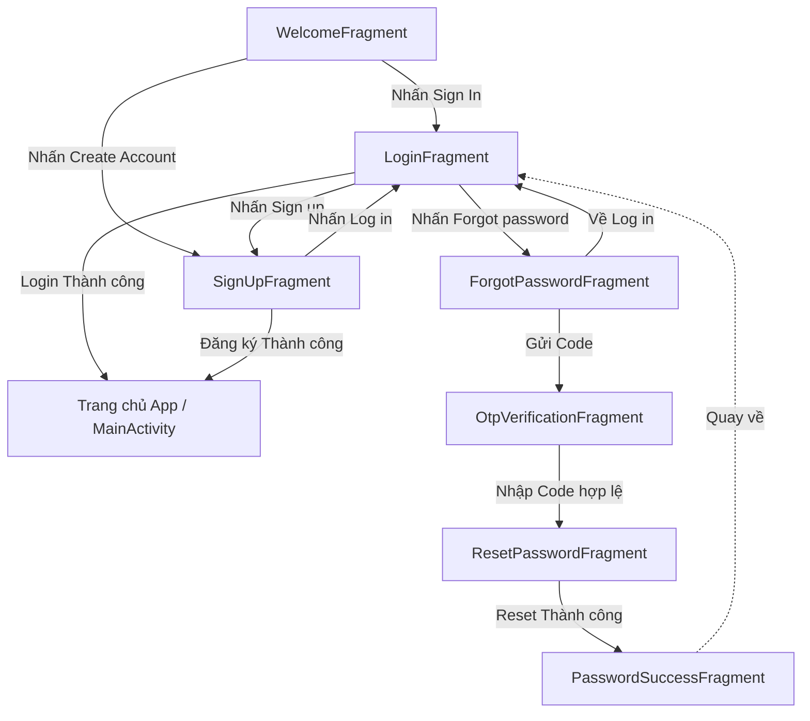

# Phân tích và Thiết kế Kế hoạch luồng Authentication

Dựa vào bản thiết kế (UI) bạn cung cấp, luồng đăng nhập/đăng ký/quên mật khẩu (Authentication) bao gồm 7 màn hình cơ bản. Dưới đây là phân tích chi tiết và cách tiếp cận để lập trình tính năng này trong Android (sử dụng Kotlin và Fragment).

## 1. Danh sách các Màn hình (Fragments) & Layouts

Để code sạch và dễ duy trì ứng dụng, chúng ta nên chia mỗi màn hình thành 1 Fragment:

1. **`WelcomeFragment` (Opening screen)**
   - **Chức năng:** Giới thiệu ngắn gọn ("Explore the app"), cung cấp 2 lựa chọn: Đăng nhập và Đăng ký.
   - **Layout (`fragment_welcome.xml`):** Logo, Tiêu đề, Subtitle, 2 Button (Sign In - nền xanh đặc, Create account - màu viền xanh, nền trắng).

2. **`LoginFragment` (Log In 3)**
   - **Chức năng:** Đăng nhập tài khoản hiện có bằng email/password hoặc mạng xã hội.
   - **Layout (`fragment_login.xml`):** 
     - Lời chào: "Hi, Welcome! 👋"
     - Các Input Fields: Email address, Password (có icon con mắt ẩn/hiện mật khẩu).
     - Text "Forgot password?" (Clickable).
     - Button "Log in".
     - Các nút Social Login: Facebook, Google, Apple.
     - Text "Don't have an account? Sign up" (Clickable).

3. **`SignUpFragment` (Sign Up 7)**
   - **Chức năng:** Tạo tài khoản mới.
   - **Layout (`fragment_sign_up.xml`):** Username, Email, Password, Checkbox Policy, Button Đăng ký, Link sang màn Đăng nhập.

4. **`ForgotPasswordFragment` (Forgot password?)**
   - **Chức năng:** Yêu cầu gửi mã khôi phục mật khẩu.
   - **Layout (`fragment_forgot_password.xml`):** Nút Back, Tiêu đề, Mô tả, Text input nhập Email của tài khoản, Button "Send code", Link về Đăng nhập.

5. **`OtpVerificationFragment` (Forgot password? - code)**
   - **Chức năng:** Nhập mã OTP gồm 4 số được gửi tới Email để xác thực.
   - **Layout (`fragment_otp_verification.xml`):** Nút Back, Mô tả chứa Email, 4 ô vuông nhập mã (Digit Code input), Button "Verify", Counter đếm ngược gửi lại mã ("Send code again 00:20"), và Bàn phím số (có thể dùng bàn phím custom trên layout hoặc bàn phím ảo của OS).

6. **`ResetPasswordFragment` (Reset password)**
   - **Chức năng:** Đặt mật khẩu mới.
   - **Layout (`fragment_reset_password.xml`):** Nút Back, TextInput "New password", TextInput "Confirm new password", Button "Reset password".

7. **`PasswordSuccessFragment` (Password changed)**
   - **Chức năng:** Thông báo đổi mật khẩu thành công.
   - **Layout (`fragment_password_success.xml`):** Logo, Tiêu đề báo thành công, Mô tả, Button "Back to login".

---

## 2. Kiến trúc Điều hướng (Navigation Flow)

Cách chuẩn và hiện đại nhất để điều phối 7 Fragment này là sử dụng thư viện **Jetpack Navigation Component**. Luồng di chuyển giữa các màn hình sẽ có dạng mô hình dưới đây:



**⚠️ Lưu ý kỹ thuật đối với Backstack (Ngăn xếp màn hình):**
- Tại màn hình **`PasswordSuccessFragment`**, khi user bấm "Back to login" để quay lại Đăng nhập, bạn phải xoá toàn bộ lịch sử (backstack) của các màn `Forgot -> OTP -> Reset -> Success`. Nếu không xoá, người dùng đăng nhập xong rồi lỡ nhấn nút Trở lại ngoài điện thoại thì nó sẽ rớt nhầm về trang `Reset Password` -> Gây lỗi Logic.
- Giải pháp: dùng thuộc tính `app:popUpTo="@id/loginFragment"` và `app:popUpToInclusive="false"` trong Navigation Graph khi mở chuyển động từ trang Success về Login.

---

## 3. Kiến trúc Dữ liệu (State & ViewModels)

Để giữ dữ liệu xuyên suốt nhiều màn hình (Ví dụ màn Forgot gửi email qua cho màn OTP, rồi màn OTP báo đúng để màn Reset thay đổi pass cho tài khoản đó), bạn nên áp dụng **SharedViewModel** hoặc điều phối dữ liệu qua Navigation SafeArgs:

- **Trường hợp dùng Bundle (SafeArgs):** `ForgotPasswordFragment` truyền trực tiếp một tham số `email` sang cho `OtpVerificationFragment`.
- **Trường hợp dùng Shared ViewModel (Dùng chung bộ nhớ qua Activity Graph):**
  - Cả 3 Fragment `Forgot`, `OTP`, `Reset` dùng chung một `AuthViewModel` giúp tiện thao tác.
  - Mã nguồn Kotlin (Tham khảo logic):
    ```kotlin
    class AuthViewModel : ViewModel() {
        var forgotPasswordEmail: String = ""
        var verificationCode: String = ""
    }
    ```

---

## 4. Chuẩn bị UI Components Dùng Chung (Tối ưu Layout Layout XML)

Do các màn hình sử dụng chung phong cách và thiết kế, thay vì vẽ lại và gõ lại mã nguồn nhiều lần, chúng ta sẽ tối ưu hoá nó bằng cách tạo ra các bộ Style/Drawable tài nguyên.

**a. Định nghĩa Màu sắc gốc trong `res/values/colors.xml`:**
- `<color name="primary_green">#3AA76D</color>` *(Màu xanh chủ đạo cho Buttons)*
- `<color name="text_dark">#333333</color>` *(Màu Text chính)*
- `<color name="text_hint_gray">#BDBDBD</color>` *(Màu Placeholder)*
- `<color name="edittext_bg_gray">#F7F8F9</color>` *(Màu xám nhạt nền ô nhập)*

**b. Khai báo Background dùng cho Viền và Button (`res/drawable`):**
- **Nút thực thi tác vụ (`bg_button_primary.xml`):** Hình chữ nhật (Shape), màu phủ đặc là `primary_green`, chỉnh độ cong viền (corners radius) khoảng `8dp` hoặc `12dp`.
- **Nút viền bên ngoài trang Welcome (`bg_button_outline.xml`):** Shape hình chữ nhật, Nền màu trong xuyết (Transparent), Viền (`stroke`) màu `primary_green`, corners tương tự như trên.
- **Background cho ô nhập `<EditText>` (`bg_edit_text.xml`):** Nền màu xám nhạt (`edittext_bg_gray`), có màu viền (`stroke`), góc cong 8dp.

---

## 5. Kế hoạch Các bước Lập trình

1. **Khởi tạo Resources (Colors, Strings, Drawables, Fonts):** Xử lý hình ảnh từ Figma (cắt file hình Logo và icon Google, Facebook, Apple thành SVG vector).
2. **Cài đặt thư viện (nếu cần):** Tích hợp thư viện Jetpack Navigation (NavGraph), ViewBinding.
3. **Cấu hình Navigation Flow (Graph):** Tạo sơ đồ với 7 Fragment, nối dây logic theo Diagram mình viết phía trên.
4. **Code CSS/XML View:** Bắt đầu dựng Layout (Ưu tiên dùng `ConstraintLayout` vì giúp thao tác các Text, khoảng cách neo linh hoạt phù hợp màn hình đa kích thước). Đặc biệt lưu ý trang OTP cần làm Custom View để làm 4 ô nhập Code sao cho thật mượt khi gõ số.
5. **Gắn Logic Kotlin:** Viết logic click Event (Gắn OnClickListener cho các Nút), validate regex nhập Text của Form Email/Password, xử lý OTP timer, v.v.
